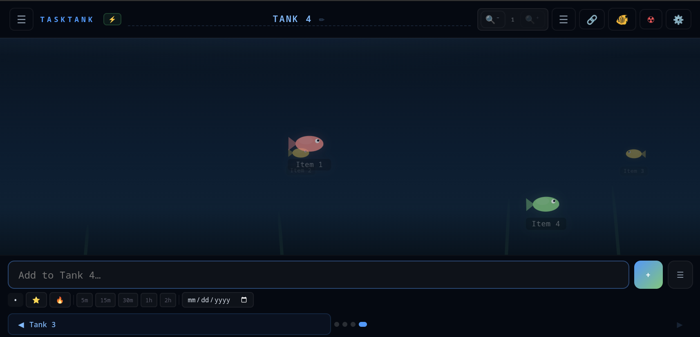

# TaskTank

A visual task manager where your tasks are fish swimming in a tank. Add tasks, watch them swim, and catch them when done.

**[Try it live](https://digitalcybersoft.github.io/tasktank/)**



## Features

- **Fish = Tasks** — each task is a fish swimming around your tank as a gentle visual reminder
- **Multiple Tanks** — organize tasks into separate tanks, swipe between them
- **Importance Levels** — normal, important (star), critical (fire) with distinct fish colors
- **Duration Timers** — set 5m, 15m, 30m, 1h, 2h timers or due dates
- **Catch to Complete** — click a fish to catch it, review in the caught panel
- **P2P Encrypted Sync** — share tanks via Nostr relays with AES-GCM encryption
- **WebRTC Direct Connections** — optional peer-to-peer for instant sync on the same network
- **File Attachments** — attach files to tasks, transferred via WebRTC between devices
- **QR Code Sharing** — scan a QR code to join a shared tank
- **Device Pairing** — pair your devices for automatic cross-device sync
- **PWA** — installable as a Progressive Web App on any platform
- **Desktop App** — native desktop builds via Tauri v2

## Getting Started

```bash
npm install
npm run dev
```

Open http://localhost:5173 to use the app.

### Production Build

```bash
npm run build
```

Static files are output to `dist/`.

### Desktop (Tauri)

```bash
npm run tauri:dev     # dev with HMR
npm run tauri:build   # .deb / .AppImage / .rpm
```

## P2P Sync

Sharing a tank generates an encrypted share code (or QR code). The other device joins using that code. All data is encrypted with AES-GCM before being sent to Nostr relays — the relays never see your task data. With direct connections enabled, devices also connect via WebRTC for faster sync.

## Testing

```bash
npm test          # 81 unit tests (vitest)
npm run test:e2e  # 5 E2E tests (Puppeteer + Chrome)
```

## Tech Stack

React 19, Vite, nostr-tools, Web Crypto API, WebRTC, IndexedDB, Tauri v2, vite-plugin-pwa
